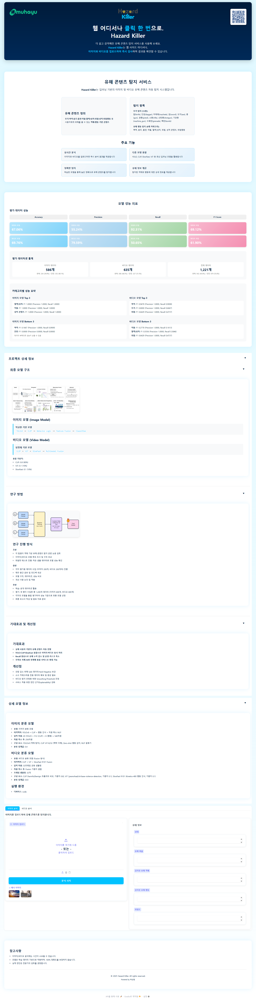

# Hazard Killer - 유해 콘텐츠 탐지 시스템

> 개인 사이드 프로젝트: 팀 프로젝트에서 개발된 모델을 활용한 웹 데모 인터페이스 구현  
> 평가 데이터셋(1,200개)에 대한 추가 분석 결과를 포함하여 웹 데모에 통합

딥러닝 기반 이미지·비디오 유해 콘텐츠 자동 탐지 웹 데모

## 프로젝트 개요

YOLOv8, CLIP, SlowFast 등 최신 딥러닝 모델을 활용한 이미지·비디오 유해 콘텐츠 자동 탐지 시스템

### 웹 데모 화면



### 주요 기능

- **이미지 분석**: 유해 객체 및 행동 탐지
- **비디오 분석**: 시간적 패턴을 고려한 유해 콘텐츠 탐지
- **카테고리 기반**: 9개 카테고리, 8개 행동으로 세분화
- **실시간 분석**: 웹 인터페이스에서 즉시 결과 확인

### 탐지 항목

**유해 객체 (20종, 카테고리 기반)**
- **무기류 (12종)**: knife, dagger, machete, sword, axe, gun, pistol, rifle, shotgun, machine_gun, grenade, bomb
- **음주 (2종)**: wine glass, beer
- **흡연 (2종)**: cigarette, lighter
- **약물 (1종)**: syringe
- **혈액/상처 (3종)**: blood, injury, wound

**유해 행동 (8종)**
- violence (폭력 행위)
- alcohol (음주 행위)
- smoking (흡연 행위)
- drugs (약물 사용)
- blood (혈액/상처)
- threat (위협적 행동)
- sexual (성적 콘텐츠)
- dangerous (위험행동)

## 설치 방법

### 1. 가상 환경 생성 및 활성화

```bash
# Windows
python -m venv venv
venv\Scripts\activate

# Linux/Mac
python3 -m venv venv
source venv/bin/activate
```

### 2. PyTorch 설치 (GPU 사용 시)

```bash
# CUDA 12.1용 PyTorch 설치
pip install torch torchvision torchaudio --index-url https://download.pytorch.org/whl/cu121
```

### 3. 패키지 설치

```bash
pip install -r requirements.txt
```

### 4. 모델 가중치 준비

`weights` 폴더에 다음 파일들이 필요합니다:
- `image_model_best.pth` - 이미지 분류 모델 가중치
- `video_model_best.pth` - 비디오 분류 모델 (fusion 방식)
- `yolov8n.pt` - YOLOv8 객체 탐지 모델

## 실행 방법

### 웹 앱 실행 (Gradio 인터페이스)

```bash
# 가상 환경 활성화
venv\Scripts\activate  # Windows
# 또는
source venv/bin/activate  # Linux/Mac

# 웹 앱 실행
python app.py
```

**접속:**
- 로컬: `http://localhost:7860`
- 외부: `config.py`에서 `GRADIO_SHARE = True` 설정 시 공개 링크 생성

## 모델 평가

평가 데이터셋(1,200개)에 대한 상세 분석을 수행했습니다. `evaluate_category.py` 스크립트를 실행하여 카테고리별 성능 지표를 산출하고, 그 결과를 웹 데모에 통합했습니다.

```bash
# 가상 환경 활성화
venv\Scripts\activate  # Windows
# 또는
source venv/bin/activate  # Linux/Mac

# 평가 스크립트 실행
python evaluate_category.py
```

**평가 결과:**
- 전체 성능 지표 (Accuracy, Precision, Recall, F1-Score)
- 카테고리별 상세 분석
- 모델 성능 비교 테이블
- 데이터셋 통계

### 평가 결과 출력 항목

평가 스크립트는 다음과 같은 상세한 분석 결과를 제공합니다:

1. **평가 데이터셋 통계**
   - 이미지·비디오 평가 데이터 개수
   - 유해/안전 데이터 비율
   - 전체 데이터 요약

2. **전체 성능 지표**
   - **Accuracy**: 전체 정확도
   - **Precision**: 정밀도 (유해로 예측한 것 중 실제 유해 비율)
   - **Recall**: 재현율 (실제 유해인 것 중 유해로 예측한 비율)
   - **F1-Score**: Precision과 Recall의 조화 평균
   - **Confusion Matrix**: 혼동 행렬 (TN, FP, FN, TP)

3. **카테고리별 상세 분석**
   - 카테고리별 데이터 분포
   - 카테고리별 성능 지표 (Accuracy, Precision, Recall, F1)
   - 데이터 불균형 경고 (20개 미만 카테고리)
   - 성능이 낮은 카테고리 분석

4. **카테고리별 성능 요약**
   - Top 3 성능 우수 카테고리
   - Bottom 3 개선 필요 카테고리

5. **모델 성능 비교 테이블**
   - 이미지 모델 vs 비디오 모델 직접 비교
   - 각 지표별 차이 및 우위 표시

6. **실행 시간 정보**
   - 전체 평가 소요 시간

평가 결과는 발표 자료 작성에 바로 활용할 수 있도록 구조화되어 있습니다.

## 설정 변경

`config.py`에서 주요 설정 변경 가능:

- `IMAGE_THRESHOLD`: 이미지 임계값 (체크포인트에서 자동 로드)
- `VIDEO_THRESHOLD`: 비디오 임계값 (0.63)
- `FRAME_SAMPLE`: 프레임 샘플링 수 (32)
- `GRADIO_SERVER_PORT`: 서버 포트 (7860)

## 아키텍처

### 이미지 분류 모델

1. **YOLOv8**: 객체 탐지 (20차원)
2. **CLIP**: 맥락 이해 (512차원)
3. **행동 인식**: Zero-shot 행동 점수 (8차원)
4. **특징 결합**: 540차원 → 256차원 축소
5. **MLP 분류기**: 최종 유해 확률 출력

### 비디오 분류 모델 (Fusion 방식)

1. **32프레임 샘플링**: 균등 추출
2. **CLIP (가중치 0.8)**: harmful/benign 프롬프트 비교
3. **ViT (가중치 0.1)**: violence detection 특화 모델
4. **SlowFast R101 (가중치 0.1)**: 행동 인식
5. **Fusion**: 가중치 결합으로 최종 점수 계산
   - `confidence = 0.8 * CLIP + 0.1 * ViT + 0.1 * SlowFast`

## 프로젝트 구조

```
harmful_content_demo/
├── app.py                    # Gradio 웹 인터페이스 메인 파일
├── evaluate_category.py      # 모델 평가 스크립트 (카테고리별 상세 분석)
├── models.py                 # 모델 클래스 정의 (HarmfulImageClassifier, HarmfulVideoClassifier)
├── inference.py              # 추론 함수 (이미지/비디오 유해 콘텐츠 탐지)
├── config.py                 # 설정 파일 (경로, 하이퍼파라미터, 디바이스)
├── requirements.txt          # Python 패키지 의존성 목록
├── examples/                 # 예제 이미지 파일
├── weights/                  # 모델 가중치 파일
│   ├── image_model_best.pth  # 이미지 분류 모델 (540차원)
│   ├── video_model_best.pth  # 더미 파일 (Fusion 방식 사용으로 불필요)
│   └── yolov8n.pt            # YOLOv8 객체 탐지 모델
└── README.md                 # 프로젝트 문서
```

## 주요 특징

- **멀티모달**: 이미지·비디오 각각 최적화된 모델
- **카테고리 기반**: 9개 유해 카테고리, 8개 행동 세분화
- **Zero-shot**: CLIP 기반 프롬프트 행동 인식
- **Fusion**: CLIP + ViT + SlowFast 가중치 결합
- **상세 평가**: 카테고리별 성능 분석 제공

## 모델 및 웹 데모

### 모델 개발 과정

모델 개발 및 실험 과정은 팀 프로젝트로 진행되었으며, 별도의 레포지토리에서 관리됩니다.

**모델 발전 과정 및 실험 기록**: [https://github.com/psw204/harmful-detect-muhayu](https://github.com/psw204/harmful-detect-muhayu)

해당 레포지토리에는 다음 내용이 포함되어 있습니다:
- 각 팀원의 모델 실험 과정 (안지산, 박상원, 임영재)
- 모델 구조 발전 과정 (final_model1 ~ final_model11)
- 데이터 수집 및 라벨링 도구
- 학습 스크립트 및 평가 코드
- 최종 모델 선정 과정 및 성능 비교

### 웹 데모 인터페이스

본 레포지토리는 팀 프로젝트에서 개발된 최종 모델을 활용하여 웹 데모 인터페이스를 구현한 것입니다.

**사용 모델:**
- **이미지 모델**: final_model11 (YOLO + CLIP + 행동인식, 540차원)
- **비디오 모델**: Fusion 방식 (CLIP + ViT + SlowFast)

## 참고사항

- 학습 데이터 기반으로 작동, 100% 정확도 보장하지 않음
- 실제 판단은 전문가 검토 권장
- 모델 가중치는 `weights` 폴더에 필요
- 평가 스크립트는 발표 자료용 결과 제공

---

© 2025 Hazard Killer
